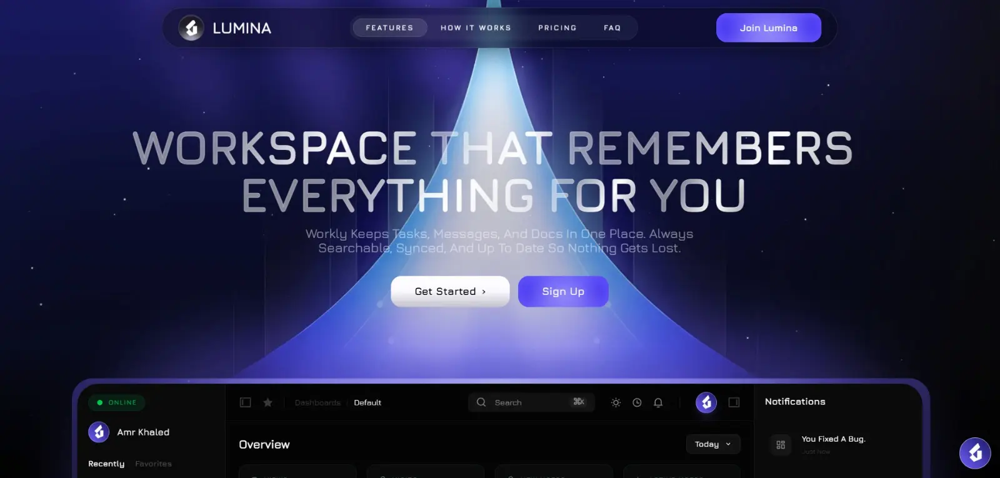

# 👋 Hey there, I'm Mohamed Emara

🎯 **Frontend React Developer** with 2+ years of experience crafting responsive, animated, and high-performance web applications.  
💡 Passionate about building smooth UI/UX experiences that blend design, motion, and modern web technologies.  
🌍 Currently working remotely with a Jordan-based tech company.  

📄 **Resume:** [View My Resume](https://raw.githubusercontent.com/dev-mohammed-emara/dev-mohammed-emara/main/resume.pdf)

🎨 **Portfolio:** [ [https://dev-mohammed-emara-portfolio.netlify.app/](https://dev-mohammed-emara-portfolio.netlify.app/) ]

---

## 💫 About Me  

- 💻 Focused on **React**, **JavaScript**, and **TypeScript**  
- 🎨 Love building **responsive**, **animated**, and **high-tech** UI/UX  
- ⚙️ Skilled in **GSAP**, **Framer Motion**, **TailwindCSS**, **CSS3 animations**  
- 🧩 Experienced with **Redux**, **Zustand**, and **GraphQL** for scalable state management and data flow  
- 🌐 Comfortable using **Bootstrap** for rapid responsive prototyping  
- 🧠 Currently diving deep into **✨ Three.js ✨** — exploring 3D web experiences and interactive scenes with real passion  
- 🚀 Always learning, improving, and experimenting with new web technologies  

---

## 🧭 Engineering Philosophy  

- 🧠 **Clarity over cleverness** — readable code scales better than smart hacks  
- ⚡ **Performance is a feature**, not an afterthought  
- 🎨 **UI/UX is part of engineering**, not decoration  
- 🧩 Prefer **composable, reusable components** over monoliths  
- 🚀 Build for **real users, real devices, and real constraints**
---
## 📌 What I’m Known For  

- ⚡ High-performance **React & Next.js** interfaces  
- ✨ Advanced **motion & animation systems** (GSAP / Framer Motion)  
- 🌐 Interactive **3D web experiences** with Three.js  
- 💡 Turning complex ideas into **clean, usable products**
---
 
 

## 👨‍💻 What I'm Doing Now  

- 🔭 Currently improving my skills as a **Next.js Web Application Developer**  
- 🌱 Learning **Advanced Next.js, TypeScript, Server Components, API Routes, and Full-Stack Architecture**  
- 🧠 Deep diving into **State Management (Context API / Redux Toolkit / Zustand)** and **Scalable Clean Architecture**  
- ⚡ Building high-performance, SEO-optimized, production-ready web applications  
- 🏆 Team Leader (Group Leader) @ DEPI  
- 🌟 Leading DevSync TEAM for our DEPI graduation project  

---

## 🤝 Collaboration & Goals  

- 🤝 Open to collaborate on **Next.js web apps, SaaS platforms, and full-stack projects**  
- 🎯 My goal is to build real-world scalable products and work as a **Professional Full-Stack React / Next.js Developer**  
- 🚀 Focused on performance, UI/UX excellence, and production-level code quality  
- ❤️ Actively participating in community volunteering and charity initiatives  

---
## 📍 Availability  

- 💼 Open to **Frontend / Full-Stack React & Next.js roles**  
- 🤝 Available for **freelance & contract projects**  
- 🌍 Remote-friendly (MENA / EU time zones)
---

## 🚀 Latest Work

---

> **Lumina AI (LuminaDevEg)** — A modern **Agentic AI web platform** built to deliver intelligent, scalable, and user-centric AI solutions.  
>  
> I am a **Co-Partner and the Main Frontend Developer**, and one of the **original trio who founded and built LuminaDevEg** from the ground up.  
> I led the frontend architecture and implementation, focusing on performance, scalability, and premium UI/UX.  
>  
> 🔹 Agentic AI–driven platform  
> 🔹 Co-founder & Main Frontend Developer  
> 🔹 Production-ready, scalable web application  
> 🔹 Clean architecture & high-performance UI  

🔗 **Live Platform:** https://luminadeveg.com/

---

## 🏗️ Selected Works

| Project | Essence | Experience |
| :--- | :--- | :---: |
| ⚡ **Zentry** | Award-winning gaming site recreation with intense GSAP. | [**Live Demo**](https://zentry-emara-replica.netlify.app/) |
| 🍎 **Apple Replica** | iPhone 15 Pro site with 3D models and smooth scrolling. | [**Live Demo**](https://mortiswebphonestore.netlify.app/) |
| 🦷 **SEVEN Digital Dental** | High-end **dental clinic branding** and interactive web presence focused on trust, clarity, and patient-friendly UX. | [**Live Demo**](https://seven-digital-dental.netlify.app/) |
| 🚀 **MK Agency** | Modern agency landing page with sleek transitions. | [**Live Demo**](https://mk-agency-six.vercel.app/) |
| 💳 **ITAIF Jordan** | Ticket management system for Jordan's tech leaders. | [**Live Demo**](https://itaif-jo.com/) |

---

## 🛠️ The Forge (Expanded Tech Stack)

### 🚀 Core Stack

---

### 🎨 UI & Motion

---

### 🧠 Architecture & State

---

### ⚙️ Backend & Deployment

---

### 🛠️ Workflow & Code Quality

---

### 🎨 Design & Creative Tools

---

## 📈 Parallel Realities (GitHub Stats)

 

 
 

 
 

---
## 🌐 Connect With Me  

   

---

### ⚡ Fun Fact  
> “Animation is not just motion — it’s emotion.”  
> And now... **3D is where imagination becomes interaction.** 🪄

---

✨ _Built with passion, precision, and React (and lately, a lot of Three.js)._ ✨

